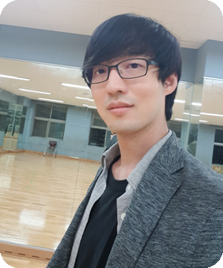
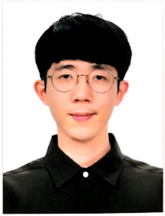

# LAB Members

___
 

## Professor
Young-Keun Kim, Ph.D.  

* 2014: KAIST Mechanical Engineering, Ph.D 
* 2014~current: Associate Professor, School of Mechanical and Control Engineering, Handong Global University
* 2020: Visiting Scholoar at Virginia Tech Mechanical Engineering
* 2017~19: Head of Mechanical and Control Engineering,HGU

 

## Graduate Student

박재은,  Ph.D Candiate

 

유지환, Master Degree candidate

 

송형석, Master Degree candidate

 

김예진, Master Degree candidate

 

 

## Undergraduate Research 

***

 
 

# Alumni

## Graduate Student

| 졸업연도 | 이름   | 졸업연구 주제명                                 | 학위   | 회사명/대학원명                       | 부서           | 비고       |
| ---- | ---- | ---------------------------------------- | ---- | ------------------------------ | ------------ | -------- |
| 2017 | 장찬희  | Mono-Vision based Vehicle Localization using Road Sign On-line Database (온라인 도로 표지판 정보를 사용한 단일 카메라 기반의 차량 위치추정 연구) | 석사   | ATI (Advanced Technology Inc.) | 데이터사이언스팀     | 반도체 머신비전 |
| 2019 | 박재은  | Research of Deep Reinforcement Learning based Control System Design for a Nonlinear Tunable Vibration Absorber using Smart Rubber(심층인공신경망 강화학습을 통한 스마트고무 기반 비선형 진동흡수기 제어시스템 설계 연구) | 석사   | 한동대학교 기계제어공학과                  | 박사과정         |          |
| 2020 | 오선택  | Development of Compressed Deep Neural Networks based Object Detection Algorithm for Implementation on FPGA Embedded Platform(FPGA 임베디드 플랫폼 탑재를 위한 심층신경망 압축모델 기반 객체탐지 알고리즘 개발) | 석사   | 위씨 (창업)                        | 영상기반 지능형 시스템 |          |

## Undergraduate Student

| 연도   | 이름   | 졸업연구 주제                                  | 회사/대학원 명              | 부서명              |
| ---- | ---- | ---------------------------------------- | --------------------- | ---------------- |
| 2014 | 이명호  | Detecting Curved Lane with Spline Approximation | FITI 시험연구원            |                  |
| 2014 | 윤국   | Detecting Curved Lane with Spline Approximation | 현대자동차                 |                  |
| 2014 | 김한결  | Detecting Curved Lane with Spline Approximation |                       |                  |
| 2014 | 김영훈  | Signpost Image Based Localization for Vehicle Navigation | 한동대학교 대학원             |                  |
| 2014 | 홍다현  | Signpost Image Based Localization for Vehicle Navigation | 경동나비엔                 |                  |
| 2014 | 남건일  | 태양전지 효율향상을 위한 영상 및 네트워크 기반의 회전형 태양광 반사 장치 개발 |                       |                  |
| 2014 | 김현목  | 태양전지 효율향상을 위한 영상 및 네트워크 기반의 회전형 태양광 반사 장치 개발 | GME                   |                  |
| 2014 | 송준현  | 파노라마 영상 촬영 카메라를 위한 2축 수평유지장치             | 현대중공업                 |                  |
| 2014 | 신범철  | 친환경소재의 가변강성 액추에이터 개발                     | 현대모비스                 |                  |
| 2014 | 윤정환  | 친환경소재의 가변강성 액추에이터 개발                     | KAIST-박사과정            |                  |
| 2014 | 장찬희  | Curved Lane Detection                    | 한동대학교 대학원             |                  |
| 2014 | 박영지  | Curved Lane Detection                    |                       |                  |
| 2014 | 정지혜  | Curved Lane Detection                    | 한국전기공사                |                  |
| 2015 | 백두산  | HILS for Verification of ABS Algorithm   | 현대모비스                 |                  |
| 2015 | 김야곱  | HILS for Verification of ABS Algorithm   | 세메스                   |                  |
| 2015 | 이영은  | Solar Panel Cleaning Robot               | 고려대학교 대학원             |                  |
| 2015 | 안다솔  | Solar Panel Cleaning Robot               | 고려제강                  |                  |
| 2015 | 이호석  | Active Safety System with Lane and Obstacle Detection for HGU Autonomous Vehicle | 현대자동차                 |                  |
| 2015 | 임찬미  | Active Safety System with Lane and Obstacle Detection for HGU Autonomous Vehicle | 현대자동차                 |                  |
| 2015 | 박종혁  | Robust Traffic sign detection and recognition for autonomous vehicle | 네이버                   |                  |
| 2016 | 김혜신  | 자기유변 겔을 활용한 저전력 진동 감쇄장치 설계               | 현대중공업                 |                  |
| 2016 | 김현기  | 자기유변 겔을 활용한 저전력 진동 감쇄장치 설계               | 서울대학교-박사과정            |                  |
| 2016 | 박재은  | 전자식 주차 브레이크의 동적제어를 위한 논리 설계              | 한동대학교 대학원             |                  |
| 2016 | 임창현  | 전자식 주차 브레이크의 동적제어를 위한 논리 설계              |                       |                  |
| 2016 | 장대익  | MRGEL 동적특성 분석 연구                         | KAIST 건설 및 환경공학과 박사과정 |                  |
| 2016 | 윤가은  | MRGEL 동적특성 분석 연구                         | 포스텍 대학원               |                  |
| 2016 | 백찬웅  | MRGEL 셀프센싱 특성분석 연구                       |                       |                  |
| 2017 | 정기동  | 시각장애인을 위한 보행 보조기기구 설계 2                  | 공군 장교                 |                  |
| 2017 | 김호민  | 시각장애인을 위한 보행 보조기기구 설계 2                  | 서울대학교 대학원             |                  |
| 2017 | 오선택  | 시각장애인을 위한 보행 보조기기구 설계 2                  | 한동대학교 대학원             |                  |
| 2017 | 석성준  | 강성가변 엔진마운트 설계                            | 현대자동차                 |                  |
| 2017 | 박정훈  | 강성가변 엔진마운트 설계                            | 포스텍 대학원               |                  |
| 2017 | 서주원  | MRE 마찰가변 특성연구                            | 한양대학교 대학원             |                  |
| 2017 | 문영진  | MRE 마찰가변 특성연구                            | 고려제강                  |                  |
| 2018 | 주요한  | FPGA를 이용한 기어 불량 검출 머신비전 시스템 개발           | GIST 대학원              |                  |
| 2018 | 이지희  | FPGA를 이용한 기어 불량 검출 머신비전 시스템 개발           | 고려제강                  |                  |
| 2018 | 간주원  | LiDAR-Camera Calibration                 | 현대중공업                 | 엔진기계사업부          |
| 2018 | 노미림  | LiDAR-Camera Calibration                 | 현대자동차                 |                  |
| 2018 | 이강현  | MR Coupling                              | 서울대학교 대학원             |                  |
| 2018 | 안태현  | Vision ADAS 연동 TCU                       | 현대 오트론                |                  |
| 2018 | 송민호  | Vision ADAS 연동 TCU                       | 제낙스                   |                  |
| 2018 | 최혁인  | Vision ADAS 연동 TCU                       | ASML                  |                  |
| 2019 | 최디도  | MRE 스마트제진 시스템                            | 현대모비스                 | 샤시안전 BU 전자제동제어섹터 |
| 2019 | 김예진  | MRE 스마트제진 시스템                            | 한동대학교 대학원             |                  |
| 2019 | 김광은  | MRE 스마트제진 시스템                            | 공군 장교                 |                  |
| 2019 | 황재욱  | LiDAR 기반 차선인식                            | 뷰런테크놀로지               |                  |
| 2019 | 서주찬  | LiDAR 기반 차선인식                            | GIST 대학원              |                  |
| 2019 | 강수빈  | LiDAR 기반 차선인식                            | DELL 컴퓨터              |                  |
| 2019 | 김예함  | LiDAR-Camera Inspection                  | 취업준비중                 | 아카데미 42 서울       |
| 2019 | 이예은  | LiDAR-Camera Inspection                  | 현대자동차                 | 전동화제어개발1팀        |
| 2019 | 황시환  | 라이다 물체인식 연구                              | KAIST 대학원             | 녹색그린교통대학원        |
| 2019 | 조성현  | 스마트 CCTV 개발                              |                       |                  |
| 2019 | 김형우  | 스마트 CCTV 개발                              | MIDAS IT              | 데이터 서버           |
| 2020 | 한우석  | Investigation on Dynamic-Stress Sensing Property of Stiffness-Variable Magnetorheological elastomer for Application of Tunable Vibration Absorber | DGIST 대학원             |                  |
| 2020 | 권하은  | Investigation on Dynamic-Stress Sensing Property of Stiffness-Variable Magnetorheological elastomer for Application of Tunable Vibration Absorber | 한양대학교 대학원             |                  |
| 2020 | 송윤경  | Investigation on Dynamic-Stress Sensing Property of Stiffness-Variable Magnetorheological elastomer for Application of Tunable Vibration Absorber |                       |                  |
| 2020 | 심이삭  | YOffleNet: Compressing CNN Model for Object Detection on Embedded Platforms | 유학 준비 중               |                  |
| 2020 | 임주형  | YOffleNet: Compressing CNN Model for Object Detection on Embedded Platforms | 네패스                   |                  |
| 2020 | 장영완  | YOffleNet: Compressing CNN Model for Object Detection on Embedded Platforms | 노타                    |                  |
| 2020 | 송형석  | LiDAR Extrinsic Calibration using a Cubic Target | 한동대 대학원               |                  |
| 2020 | 문선빈  | LiDAR Extrinsic Calibration using a Cubic Target | 노타 인턴                 |                  |
