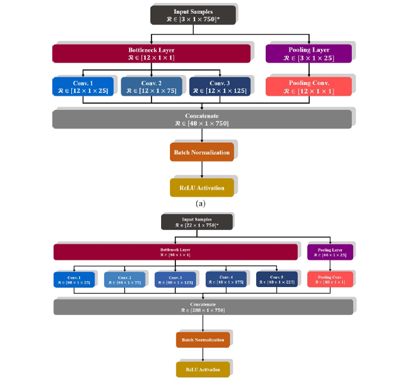

# Industry Applied Intelligence

## Industrial AI 

### Prediction of Parking Free Space

포항시 스마트 시티 주차안내 시스템 - 주차 여유 공간 예측 알고리즘 개발:  WeSEE X HGU SSS Lab

<iframe width="560" height="315" src="https://www.youtube.com/embed/MpNni2Jw3Zk" title="YouTube video player" frameborder="0" allow="accelerometer; autoplay; clipboard-write; encrypted-media; gyroscope; picture-in-picture" allowfullscreen></iframe>

 

### Unsupervised Defect Detection for Wire Rod, Steel Industry

2022.01.13 10:24

한동대학교가 현대제철과 공동 개발한 인공지능(AI) 기반 제철 자동화 기술이 실제 기업 생산 현장에 적용돼 산학협력 모델로 평가받고 있다. 한동대는 현대제철 포항공장 봉강생산실과 지역 산학협력 프로그램으로 AI 기반 특수강 표면결함 분류작업 자동화 시스템을 개발, 포항공장에 적용했다고 13일 밝혔다...

https://m.etnews.com/20220113000057

 

### EEG-inception: an accurate and robust end-to-end neural networkfor EEG-based motor imagery classification

Classification of electroencephalography (EEG)-based motor imagery (MI) is a crucial
non-invasive application in brain–computer interface (BCI) research. This paper proposes a novel convolutional neural network (CNN) architecture for accurate and robust EEG-based MI
classification that outperforms the state-of-the-art methods.

* A CNN-based classification achieving 88.6% in the average accuracy outperforming all other state-of-the-art methods for binary classes dataset and 88.4% for four classes dataset.

Citation

Zhang, Ce, Young-Keun Kim, and Azim Eskandarian. "EEG-inception: an accurate and robust end-to-end neural network for EEG-based motor imagery classification." Journal of Neural Engineering 18.4 (2021): 046014. 
