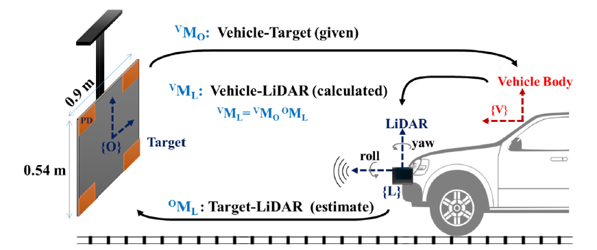
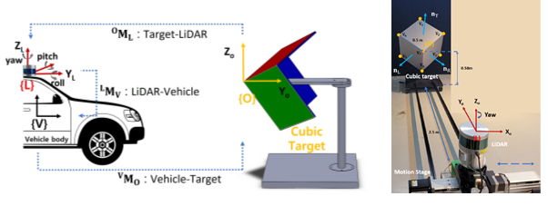
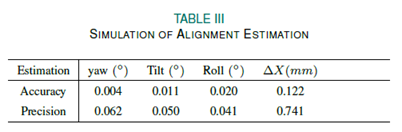

Research topics can be grouped as (1) Vehicle LiDAR-Vehicle  Extrinsic Calibration and (2) 3D Object Detection. 

  

------

# LiDAR Extrinsic Calibration

## Accurate Alignment Inspection System for Low-Resolution Automotive LiDAR

We have developed an automatic and accurate inspection system for LiDAR alignment for application in the automobile industry. 

A misalignment of LiDAR as low as a few degrees could cause a significant error in obstacle detection and mapping that could cause safety and quality issues.

The proposed methods estimate the orientations and the horizontal position of the LiDAR attachment with sub-degree and millimeter level accuracy.

The high accuracy and simplicity of the proposed system make it practical for large-scale industrial applications such as automobile manufacturing process that inspects the sensor attachment for the safety quality control.

### LiDAR Alignment Inspection: 1D Planar Target based

* It is a static method for the stationary target board and vehicle during the inspection.
* Also, it only requires one pose of the target board and does not utilize other sensors, such as a camera or GPS. 
* The experimental results for a low-resolution 16 channel LiDAR (Velodyne VLP-16) confirmed that misalignment could be estimated with accuracy within 0.2 degrees and 4 mm. 

<iframe width="672" height="378" src="https://www.youtube.com/embed/koUs_ZEUY6o" title="YouTube video player" frameborder="0" allow="accelerometer; autoplay; clipboard-write; encrypted-media; gyroscope; picture-in-picture" allowfullscreen></iframe>

#### Citation

- Oh, Seontaek, Ji-Hwan You, Azim Eskandarian, and Young-Keun Kim. “Accurate Alignment Inspection System for Low-Resolution Automotive LiDAR.” IEEE Sensors Journal 21, no. 10 (2021): 11961-11968.

  [DOI: 10.1109/JSEN.2020.3049091]: DOI:10.1109/JSEN.2020.3049091

  ​

### LiDAR Alignment Inspection: 2D Board with  1-D Photodetector Arrays
- LiDAR extrinsic calibration using a target board with embedded photodetector arrays.
- LiDAR sensor pose estimated within 0.1 degree and 3 mm of precision.
- Requires a single target at static pose, applicable to manufacturing automobiles.

<iframe width="672" height="378" src="https://www.youtube.com/embed/5RCuJTI90ZQ" title="YouTube video player" frameborder="0" allow="accelerometer; autoplay; clipboard-write; encrypted-media; gyroscope; picture-in-picture" allowfullscreen></iframe>

#### Citation

- You, Ji Hwan, Seontaek Oh, Jae Eun Park, Hyeongseok Song, and Young Keun Kim, ‘A Novel LiDAR Sensor Alignment Inspection System for Automobile Productions Using 1-D Photodetector Arrays’, Measurement, 183 (2021), 109817 https://doi.org/10.1016/J.MEASUREMENT.2021.109817

  ​

### LiDAR Alignment Inspection: : a Cubic Target

* The proposed inspection system is a one-shot and static method that uses only a single cubic-shaped target at a close range of less than 2 m. 
* The proposed method with a low-resolution LiDAR (Velodyne VLP-16) resulted in measurement errors of less than 0.04◦ and 1 mm for rotation and translation alignment, respectively. 

#### Citation

Ji-Hwan You, Seontaek Oh, Jae-Eun Park, Hyeongseok Song, Young-Keun Kim,
A novel LiDAR sensor alignment inspection system for automobile productions using 1-D photodetector arrays, Measurement, Volume 183,2021,109817,
ISSN 0263-2241, https://doi.org/10.1016/j.measurement.2021.109817.

  ​

# LiDAR 3D Object Detection

## Title
### Abstract
### Citation

